<h1><a href="https://github.com/matias-saavedra-g/ucursednt">U-Cursedn't</a></h1>

Extensión de Chromium que agrega funciones adicionales a la plataforma de [U-Cursos](https://www.u-cursos.cl/) y respectivos logros por hacer cada una de ellas. Desarrollado por [matias-saavedra-g](https://github.com/matias-saavedra-g/), basado en la idea de [Eric K](https://github.com/Nyveon), [PuntitOWO](https://github.com/PuntitOwO), [sebcp](https://github.com/sebcp), [vmkovacs](https://github.com/vmkovacs), y [TaconeoMental](https://github.com/TaconeoMental): [tU-Cursos](https://github.com/Nyveon/tU-Cursos).

<a href="https://chromewebstore.google.com/detail/u-cursednt/jappfnpemaaconilafnlhdkndccfkgen"></a>

---

# Índice - [Funcionalidades](#funcionalidades)
- [Índice - Funcionalidades](#índice---funcionalidades)
- [Funcionalidades](#funcionalidades)
  - [🤖 Chat IA Flotante con Gemini](#-chat-ia-flotante-con-gemini)
  - [📋 Utilidades de Copia Fácil](#-utilidades-de-copia-fácil)
      - [Copia Fácil de Notas](#copia-fácil-de-notas)
      - [Copia Fácil de Miembros](#copia-fácil-de-miembros)
      - [Copia Fácil de Datos del Curso](#copia-fácil-de-datos-del-curso)
  - [✨ Mejoras de Interfaz y Experiencia de Usuario](#-mejoras-de-interfaz-y-experiencia-de-usuario)
      - [🖌 Renombrar Cursos](#-renombrar-cursos)
      - [💥 Secciones Colapsables](#-secciones-colapsables)
      - [💬 Interacción con Foros](#-interacción-con-foros)
      - [📖 Recortar Texto Largo ("Mucho Texto")](#-recortar-texto-largo-mucho-texto)
      - [📐 Redimensionar Vista Previa de PDF](#-redimensionar-vista-previa-de-pdf)
      - [🔊 Sonido de Entrega de Tareas](#-sonido-de-entrega-de-tareas)
      - [✨ Animaciones de Navegación](#-animaciones-de-navegación)
  - [🔔 Notificaciones y Atajos](#-notificaciones-y-atajos)
      - [Notificación de Tareas y Pendientes](#notificación-de-tareas-y-pendientes)
      - [📆 Contador de Semanas](#-contador-de-semanas)
      - [🔘 Otras Realizaciones del Curso](#-otras-realizaciones-del-curso)
      - [✔ Ventana Emergente de Calificaciones](#-ventana-emergente-de-calificaciones)
  - [🏆 Sistema de Logros](#-sistema-de-logros)
  - [⚙️ Menú de Configuración](#️-menú-de-configuración)
- [Instalación Local](#instalación-local)
  - [Chrome](#chrome)
  - [Opera](#opera)
  - [Microsoft Edge](#microsoft-edge)

---

# Funcionalidades

## 🤖 Chat IA Flotante con Gemini


> Archivo: `aiChatPopup.js`

- **Asistente Virtual:** Un popup flotante con la mascota "UCursitos" te da acceso directo a la IA de Gemini.
- **Historial de Chat:** Guarda tus conversaciones y permite exportarlas.
- **Personalización:** Configura tu propia API Key de Google AI Studio y personaliza las instrucciones del sistema para adaptar el comportamiento del asistente a tus necesidades.
- **Integración con Foros:** Envía hilos o posts completos del foro directamente al chat para obtener resúmenes, explicaciones o ayuda.

---

## 📋 Utilidades de Copia Fácil

#### Copia Fácil de Notas
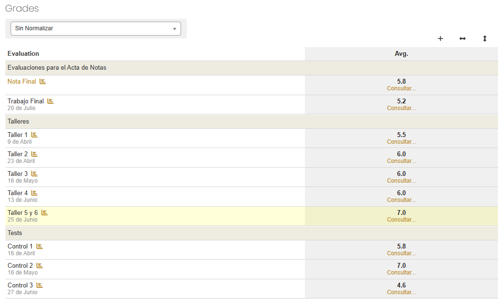

> Archivo: `easyCopyGrades.js`

- Copia rápidamente tus notas en formato horizontal (para hojas de cálculo), vertical o como una suma (para calculadoras como Wolfram Alpha).

#### Copia Fácil de Miembros
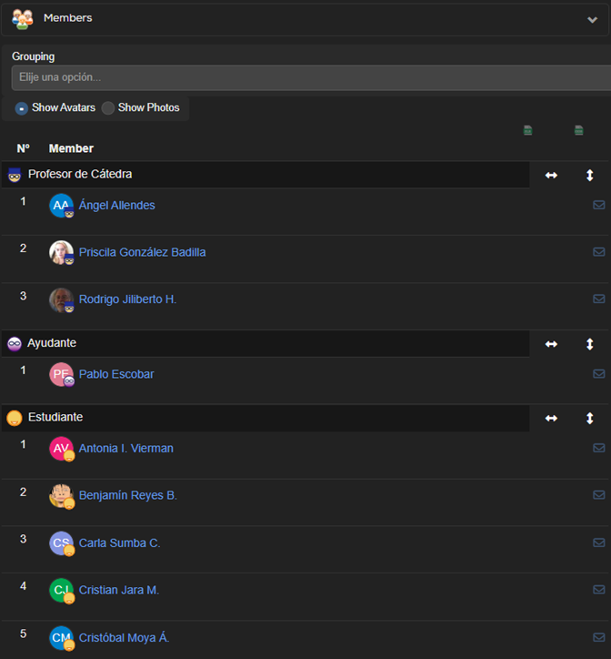

> Archivo: `easyCopyMembers.js`

- Agrega botones para copiar la lista de integrantes de un curso en formato horizontal o vertical, ideal para crear listas o informes.

#### Copia Fácil de Datos del Curso
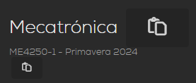

> Archivo: `easyCopyCourseDetails.js`

- Añade un botón de copiado rápido junto al nombre y código del curso para pegarlos fácilmente donde necesites.

---

## ✨ Mejoras de Interfaz y Experiencia de Usuario

#### 🖌 Renombrar Cursos
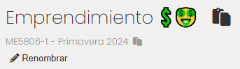

> Archivo: `renameCourses.js`

- ¿Nombres de cursos muy largos o poco descriptivos? Ahora puedes renombrarlos para una mejor organización. La extensión recordará tus nombres personalizados.

#### 💥 Secciones Colapsables
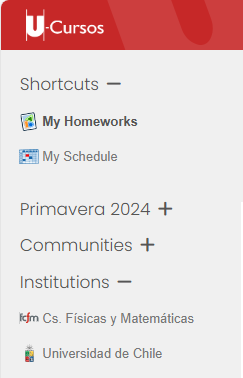

> Archivo: `collapsableMenus.js`

- Organiza tu página de inicio colapsando las secciones que no necesitas ver. La extensión guarda el estado (abierto/cerrado) de cada sección.

#### 💬 Interacción con Foros
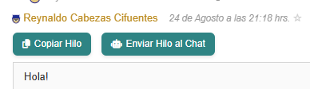

> Archivo: `forumInteraction.js`

- **Copia y envía al Chat IA:** Copia el contenido de un post o de un hilo completo, o envíalo directamente al Chat IA para un análisis rápido. Los botones se integran de forma nativa en las opciones del foro.

#### 📖 Recortar Texto Largo ("Mucho Texto")
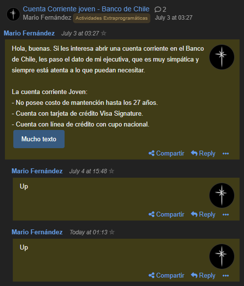

> Archivo: `muchoTexto.js`

- Oculta automáticamente los posts de foros que son muy largos detrás de un botón "Mucho Texto", manteniendo la interfaz más limpia y legible.

#### 📐 Redimensionar Vista Previa de PDF
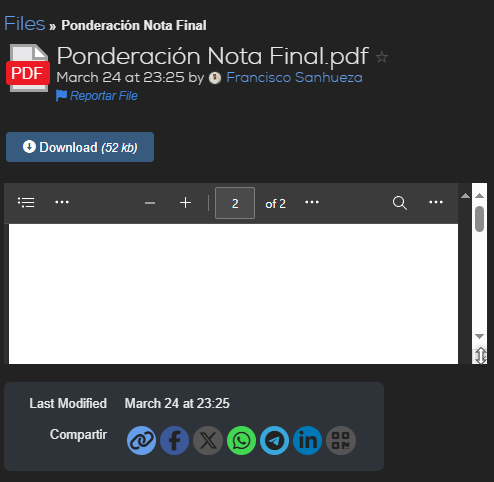

> Archivo: `resizePreviewPDF.js`

- Permite ajustar verticalmente el tamaño del visor de PDF, ideal para aprovechar mejor el espacio en pantallas verticales.

#### 🔊 Sonido de Entrega de Tareas
> Archivo: `taskSubmissionSound.js`

- Recibe una gratificante confirmación sonora (un "sonido de dopamina") cada vez que entregas una tarea.

#### ✨ Animaciones de Navegación


> Archivo: `navigationAnimations.js`

- Añade animaciones suaves y efectos visuales al menú de navegación principal para una experiencia más fluida y moderna.

---

## 🔔 Notificaciones y Atajos

#### Notificación de Tareas y Pendientes
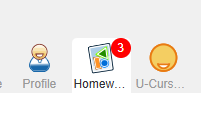 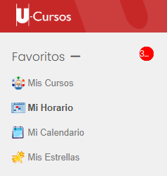

> Archivos: `pendingTasks.js`, `pendingNotifications.js`

- Muestra insignias con el número de tareas pendientes y notificaciones no leídas directamente en el menú de navegación y en las secciones de la página principal.

#### 📆 Contador de Semanas
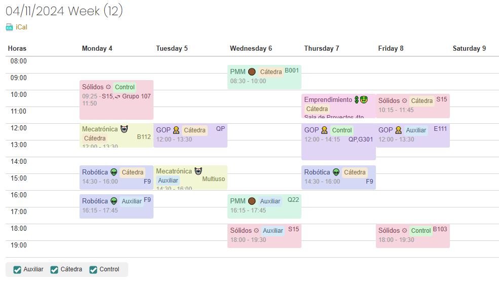

> Archivo: `weekCounter.js`

- Muestra el número de la semana actual del semestre junto a la fecha en tu horario. Funciona tanto en español como en inglés.

#### 🔘 Otras Realizaciones del Curso
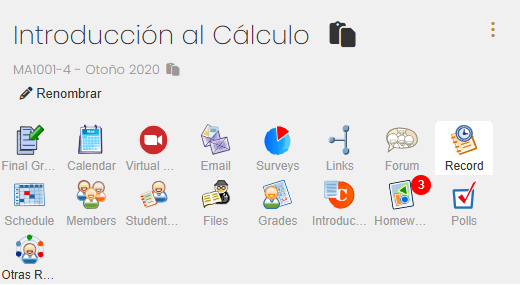

> Archivo: `otrasRealizaciones.js`

- Agrega un atajo en el menú de cada curso para acceder rápidamente a la página de "Otras Realizaciones".

#### ✔ Ventana Emergente de Calificaciones
> Archivo: `popupGrading.js`

- Abre el historial de calificaciones en una ventana emergente en lugar de redirigirte a otra página.

---

## 🏆 Sistema de Logros
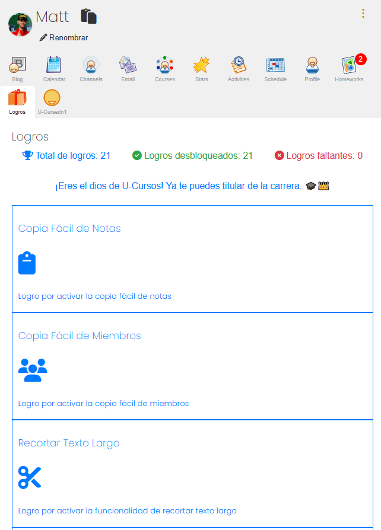

> Archivos: `achievementsGen.js`, `achievementsBoton.js`

- **Gamificación:** Desbloquea logros al utilizar las diferentes funcionalidades de la extensión.
- **Página de Logros:** Accede a una página dedicada desde el menú principal para ver tu progreso, el total de logros y los que te faltan por descubrir.

---

## ⚙️ Menú de Configuración
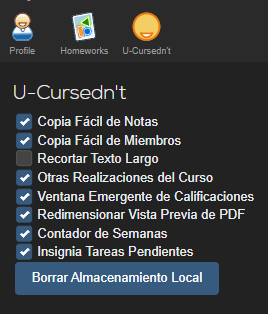

> Archivos: `menuGen.js`, `menuBoton.js`

- **Control Total:** Activa o desactiva cualquier funcionalidad de la extensión a través de un menú de configuración dedicado y fácil de usar.
- **Gestión de Datos:** Visualiza y gestiona los datos que la extensión guarda en tu navegador.

---

# Instalación Local

## Chrome

> Tutorial en [video](https://www.youtube.com/watch?v=oswjtLwCUqg) (24s).

1. Clonar el repositorio desde GitHub:
```

git clone [https://github.com/matias-saavedra-g/ucursednt.git](https://github.com/matias-saavedra-g/ucursednt.git)

```

2. Abrir Chrome y navegar a `chrome://extensions/`.

3. Habilitar el modo desarrollador (Developer Mode) en la esquina superior derecha de la página.

4. Click en "Load unpacked" (Cargar extensión sin empaquetar), luego seleccionar la carpeta clonada de la extensión (ucursednt).

5. La extensión debería cargarse y aparecer en la lista de extensiones instaladas.

## Opera

> Tutorial en [video](https://www.youtube.com/watch?v=5X9wGp3kWwA) (86s).

1. Clonar el repositorio desde GitHub:
```

git clone [https://github.com/matias-saavedra-g/ucursednt.git](https://github.com/matias-saavedra-g/ucursednt.git)

```

2. Abrir Opera y visitar `opera://extensions/`.

3. Habilitar el modo desarrollador (Developer Mode) en la esquina superior derecha de la página.

4. Click en "Load unpacked" (Cargar extensión sin empaquetar), luego seleccionar la carpeta clonada de la extensión (ucursednt).

5. La extensión debería cargarse y aparecer en la lista de extensiones instaladas.

## Microsoft Edge

> Tutorial en [video](https://www.youtube.com/watch?v=ruMPPADElqU) (39s).

1. Clonar el repositorio desde GitHub:
```

git clone [https://github.com/matias-saavedra-g/ucursednt.git](https://github.com/matias-saavedra-g/ucursednt.git)

```

2. Abrir Microsoft Edge y navegar a `edge://extensions/`.

3. Habilitar el modo desarrollador (Developer Mode) en la esquina inferior izquierda de la página.

4. Click en "Load unpacked" (Cargar extensión sin empaquetar), luego seleccionar la carpeta clonada de la extensión (ucursednt).

5. La extensión debería cargarse y aparecer en la lista de extensiones instaladas.