<h1><a href="https://github.com/matias-saavedra-g/ucursednt">U-Cursedn't</a></h1>

Extensión multiplataforma (Chromium y Firefox) que agrega funciones adicionales a la plataforma de [U-Cursos](https://www.u-cursos.cl/) y respectivos logros por hacer cada una de ellas. Desarrollado por [matias-saavedra-g](https://github.com/matias-saavedra-g/), basado en la idea de [Eric K](https://github.com/Nyveon), [PuntitOWO](https://github.com/PuntitOwO), [sebcp](https://github.com/sebcp), [vmkovacs](https://github.com/vmkovacs), y [TaconeoMental](https://github.com/TaconeoMental): [tU-Cursos](https://github.com/Nyveon/tU-Cursos).

<!-- Google Chrome Web Store Badge Container -->
<div style="display: inline-block; width: 206px; height: 58px; vertical-align: middle;">
  <a href="https://chromewebstore.google.com/detail/u-cursednt/jappfnpemaaconilafnlhdkndccfkgen">
    
  </a>
</div>

<!-- Firefox Add-on Badge Container (Cropped & Rounded) -->
<div style="display: inline-block; width: 206px; height: 58px; border-radius: 8px; overflow: hidden; vertical-align: middle; margin-left: 10px;">
  <a href="https://addons.mozilla.org/en-US/firefox/addon/u-cursedn-t/">
    
  </a>
</div>


  

---

# Índice - [Funcionalidades](#funcionalidades)
- [Índice - Funcionalidades](#índice---funcionalidades)
- [Funcionalidades](#funcionalidades)
  - [🤖 Chat IA Flotante con Gemini](#-chat-ia-flotante-con-gemini)
  - [🪟 Panel Lateral de IA (Side Panel)](#-panel-lateral-de-ia-side-panel)
  - [📋 Utilidades de Copia Fácil](#-utilidades-de-copia-fácil)
      - [Copia Fácil de Notas](#copia-fácil-de-notas)
      - [Copia Fácil de Miembros](#copia-fácil-de-miembros)
      - [Copia Fácil de Datos del Curso](#copia-fácil-de-datos-del-curso)
  - [✨ Mejoras de Interfaz y Experiencia de Usuario](#-mejoras-de-interfaz-y-experiencia-de-usuario)
      - [🖌 Renombrar Cursos](#-renombrar-cursos)
      - [🔍 Filtro Rápido en Navegación (Fuzzy Search)](#-filtro-rápido-en-navegación-fuzzy-search)
      - [💥 Secciones Colapsables](#-secciones-colapsables)
      - [🔄 Autocarga de Páginas (Infinite Scroll)](#-autocarga-de-páginas-infinite-scroll)
      - [💬 Interacción con Foros](#-interacción-con-foros)
      - [📖 Recortar Texto Largo ("Mucho Texto")](#-recortar-texto-largo-mucho-texto)
      - [📐 Redimensionar Vista Previa de PDF](#-redimensionar-vista-previa-de-pdf)
      - [🔊 Sonido de Entrega de Tareas](#-sonido-de-entrega-de-tareas)
      - [✍️ Autocompletar Tareas](#️-autocompletar-tareas)
      - [✨ Animaciones de Navegación](#-animaciones-de-navegación)
  - [🔔 Notificaciones y Atajos](#-notificaciones-y-atajos)
      - [Notificación de Tareas y Pendientes](#notificación-de-tareas-y-pendientes)
      - [📆 Contador de Semanas Inteligente](#-contador-de-semanas-inteligente)
      - [🔘 Otras Realizaciones del Curso](#-otras-realizaciones-del-curso)
      - [✔ Ventana Emergente de Calificaciones](#-ventana-emergente-de-calificaciones)
  - [🏆 Sistema de Logros](#-sistema-de-logros)
  - [🗺️ Guía de Usuario (Tour Guide)](#️-guía-de-usuario-tour-guide)
  - [⚙️ Menú de Configuración](#️-menú-de-configuración)
- [Instalación Local](#instalación-local)
  - [Chrome](#chrome)
  - [Firefox](#firefox)
  - [Opera](#opera)
  - [Microsoft Edge](#microsoft-edge)

---

# Funcionalidades

## 🤖 Chat IA Flotante con Gemini


> Archivo: `aiChatPopup.js`

- **Asistente Virtual:** Un popup flotante con la mascota "UCursitos" te da acceso directo a la IA de Gemini.
- **Conversaciones Multi-turn:** Soporte para historial de conversación completo enviado al modelo en cada consulta, para respuestas más contextuales.
- **Historial de Chat:** Guarda tus conversaciones y permite exportarlas.
- **Personalización:** Configura tu propia API Key de Google AI Studio y personaliza las instrucciones del sistema para adaptar el comportamiento del asistente a tus necesidades.
- **Integración con Foros:** Envía hilos o posts completos del foro directamente al chat para obtener resúmenes, explicaciones o ayuda.
- **Modelo actualizado:** Ahora conecta con Gemini Flash Lite Latest.

---

## 🪟 Panel Lateral de IA (Side Panel)

> Archivos: `sidepanel.html`, `sidepanel.js`, `sidepanel.css`

- **Chat IA en el Panel Lateral:** Abre un panel lateral nativo de Chrome con el asistente UCursedn't AI directamente integrado en el navegador, sin interrumpir tu navegación.
- **Arquitectura Amnesia-Proof MV3:** El estado del chat se persiste en `chrome.storage` para sobrevivir reinicios del service worker.
- **Historial persistente:** Guarda y accede a múltiples conversaciones anteriores desde el panel.
- **Soporte Gemini Nano (Local):** Detección automática de Gemini Nano para procesamiento local si está disponible.
- **Acceso rápido:** Abre el panel lateral directamente desde el popup de la extensión o el sidebar action en Firefox.

---

## 📋 Utilidades de Copia Fácil

#### Copia Fácil de Notas
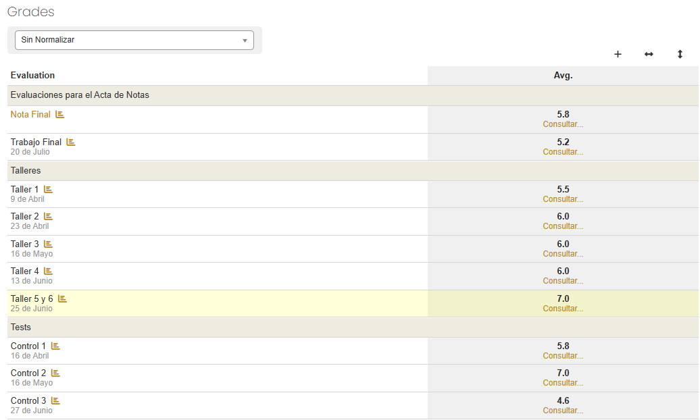

> Archivo: `easyCopyGrades.js`

- Copia rápidamente tus notas en formato horizontal (para hojas de cálculo), vertical o como una suma (para calculadoras como Wolfram Alpha).

#### Copia Fácil de Miembros
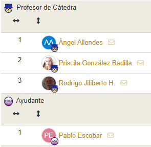

> Archivo: `easyCopyMembers.js`

- Agrega botones para copiar la lista de integrantes de un curso en formato horizontal o vertical, ideal para crear listas o informes.

#### Copia Fácil de Datos del Curso
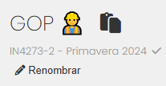

> Archivo: `easyCopyCourseDetails.js`

- Añade un botón de copiado rápido junto al nombre y código del curso para pegarlos fácilmente donde necesites.

---

## ✨ Mejoras de Interfaz y Experiencia de Usuario

#### 🖌 Renombrar Cursos
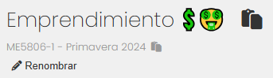

> Archivo: `renameCourses.js`

- ¿Nombres de cursos muy largos o poco descriptivos? Ahora puedes renombrarlos para una mejor organización. La extensión recordará tus nombres personalizados.

#### 🔍 Filtro Rápido en Navegación (Fuzzy Search)
> Archivos: `fuzzySearchHelper.js`, `fuzzySearch.js`

- **Búsqueda Difusa:** Se añade una barra de filtro de estilo nativo al final del contenedor del curso. Te permite escribir sin importar espacios o caracteres incompletos para buscar instantáneamente entre los elementos de navegación y las listas del historial o foros.

#### 💥 Secciones Colapsables
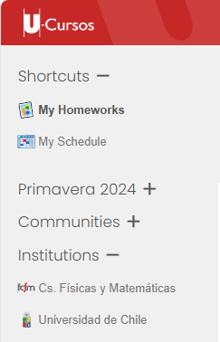

> Archivo: `collapsableMenus.js`

- Organiza tu página de inicio colapsando las secciones que no necesitas ver. La extensión guarda el estado (abierto/cerrado) de cada sección.
- **Efecto Dock de macOS:** Los elementos dentro de cada sección exhiben un efecto de magnificación al estilo del Dock de macOS al pasar el cursor.

#### 🔄 Autocarga de Páginas (Infinite Scroll)
> Archivo: `autoPreload.js`

- **Infinite Scroll:** Detecta mediante un `IntersectionObserver` cuándo te aproximas al final del historial de un curso o un foro. Carga de manera asíncrona (1 por 1) las siguientes páginas, previniendo duplicaciones o sobrecargas y respetando la codificación nativa (UTF-8/ISO-8859-1) para tildes y eñes. Los nuevos elementos se incorporan en tiempo real al Filtro Rápido.

#### 💬 Interacción con Foros
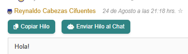

> Archivo: `forumInteraction.js`

- **Copia y envía al Chat IA:** Copia el contenido de un post o de un hilo completo, o envíalo directamente al Chat IA para un análisis rápido. Los botones se integran de forma nativa en las opciones del foro.

#### 📖 Recortar Texto Largo ("Mucho Texto")
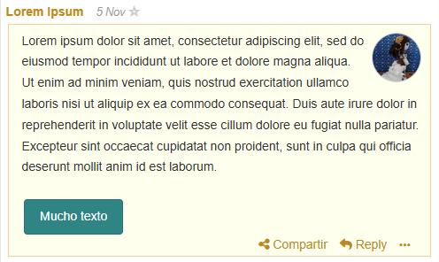

> Archivo: `muchoTexto.js`

- Oculta automáticamente los posts de foros que son muy largos detrás de un botón "Mucho Texto", manteniendo la interfaz más limpia y legible.

#### 📐 Redimensionar Vista Previa de PDF
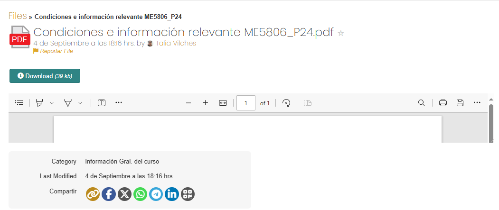

> Archivo: `resizePreviewPDF.js`

- Permite ajustar verticalmente el tamaño del visor de PDF, ideal para aprovechar mejor el espacio en pantallas verticales.

#### 🔊 Sonido de Entrega de Tareas
> Archivo: `taskSubmissionSound.js`

- Recibe una gratificante confirmación sonora cada vez que interactúas con la sección de tareas.
- Ahora activo en todas las páginas de tareas (not solo en el detalle de entrega).
- El audio se reproduce mediante un iframe de YouTube embebido.

#### ✍️ Autocompletar Tareas
> Archivo: `tareaPrefill.js`

- Rellena automáticamente el tiempo invertido y un comentario base al abrir el formulario de entrega de una tarea.
  - Se usa $ (\Delta \text{Días}) \cdot (60 \, \text{min/día}) \cdot [\text{random}(0.8, 1.2)] $ para el tiempo invertido.
  - Se usa el formato "Se hace entrega de <título de la tarea>".
- Solo actúa en la vista de detalle de tareas y respeta lo que el usuario ya haya escrito.
- Se puede activar o desactivar desde el menú de configuración de la extensión.

#### ✨ Animaciones de Navegación


> Archivo: `navigationAnimations.js`

- Añade un efecto de magnificación al estilo del Dock de macOS al menú de navegación principal: los ítems se escalan suavemente al pasar el cursor, dando una experiencia más fluida y moderna.

---

## 🔔 Notificaciones y Atajos

#### Notificación de Tareas y Pendientes
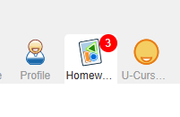 

> Archivos: `pendingTasks.js`, `pendingNotifications.js`

- Muestra insignias con el número de tareas pendientes y notificaciones no leídas directamente en el menú de navegación y en las secciones de la página principal.

#### 📆 Contador de Semanas Inteligente


> Archivo: `weekCounter.js`

- **Precisión Multi-vista:** Muestra el número de la semana lectiva actual en las 4 pestañas de horario (Agenda, Día, Semana y Mes) extrayendo la fecha de manera segura. Resuelve errores para usuarios con días libres o clases en fines de semana mediante un escaneo exhaustivo de la cuadrícula, y persiste localmente la información por semestre para cargas instantáneas.

#### 🔘 Otras Realizaciones del Curso


> Archivo: `otrasRealizaciones.js`

- Agrega un atajo en el menú de cada curso para acceder rápidamente a la página de "Otras Realizaciones".

#### ✔ Ventana Emergente de Calificaciones
> Archivo: `popupGrading.js`

- Abre el historial de calificaciones en una ventana emergente en lugar de redirigirte a otra página.

---

## 🏆 Sistema de Logros
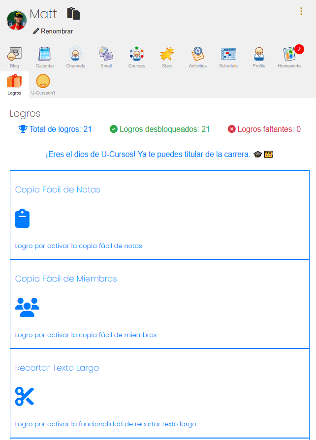

> Archivos: `achievementsGen.js`, `achievementsBoton.js`

- **Gamificación:** Desbloquea logros al utilizar las diferentes funcionalidades de la extensión.
- **Página de Logros:** Accede a una página dedicada desde el menú principal para ver tu progreso, el total de logros y los que te faltan por descubrir.

---

## 🗺️ Guía de Usuario (Tour Guide)
- **Modo Silencioso:** Centraliza las alertas informativas de primeros pasos (onboarding) mediante un interceptor global que evalúa las preferencias del usuario antes de desplegar popups invasivos.

---

## ⚙️ Menú de Configuración
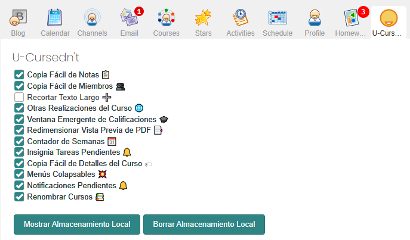

> Archivos: `menuGen.js`, `menuBoton.js`

- **Control Total:** Activa o desactiva cualquier funcionalidad de la extensión a través de un menú de configuración dedicado y fácil de usar.
- **Gestión de Datos:** Visualiza y gestiona los datos que la extensión guarda en tu navegador.

---

# Instalación Local

## Chrome

> Tutorial en [video](https://www.youtube.com/watch?v=oswjtLwCUqg) (24s).

1. Clonar el repositorio desde GitHub.
2. Ejecutar la pipeline mediante el script automatizado para empaquetar los archivos fuentes:
   ```bash
   python scripts/build.py

```

3. Abrir Chrome y navegar a `chrome://extensions/`.
4. Habilitar el modo desarrollador (Developer Mode) en la esquina superior derecha de la página.
5. Click en "Load unpacked" (Cargar extensión sin empaquetar), luego seleccionar la carpeta generada **`dist/chrome/`**.

## Firefox

1. Clonar el repositorio desde GitHub.
2. Ejecutar el script automatizado para estructurar el compilado de Gecko:
```bash
python scripts/build.py

```


3. Abrir Firefox y navegar a `about:debugging#/runtime/this-firefox`.
4. Click en "Load Temporary Add-on..." (Cargar complemento temporal).
5. Seleccionar el archivo **`dist/firefox/manifest.json`** o directamente el paquete comprimido `.zip` generado en la raíz de `dist/`.

## Opera

1. Realizar los pasos de compilación con `python scripts/build.py`.
2. Abrir Opera y visitar `opera://extensions/`.
3. Activar Modo Desarrollador y cargar la carpeta descomprimida **`dist/chrome/`**.

## Microsoft Edge

1. Realizar los pasos de compilación con `python scripts/build.py`.
2. Abrir Microsoft Edge y navegar a `edge://extensions/`.
3. Activar Modo Desarrollador y cargar la carpeta descomprimida **`dist/chrome/`**.

---

> **Nota sobre el versionado:** U-Cursedn't usa un esquema de versión basado en fecha: **`AA.MM.V`**, donde `AA` es el año (dos dígitos), `MM` el mes, y `V` el número de versión dentro del mes Por ejemplo, `26.6.1` corresponde a la primera versión de junio de 2026.

> **Integración Continua y Validación:** Cada versión pasa por un proceso de linting estático pre-build integrado en Python que valida la sanidad de los JSONs, previene el uso inseguro de `innerHTML` y busca tokens de sintaxis rotos (como comas consecutivas). Conserva un historial histórico rotativo de hasta 3 versiones empaquetadas en la carpeta `/archive`.